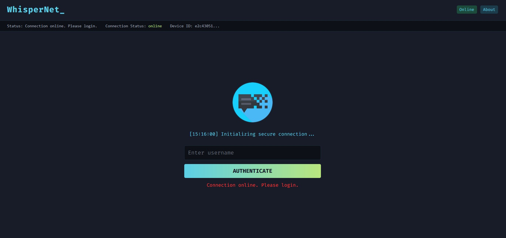
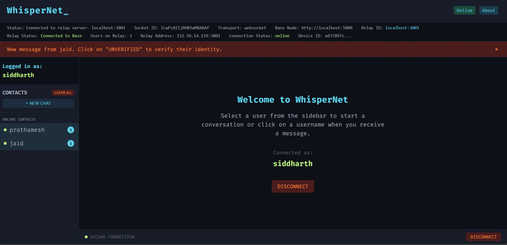
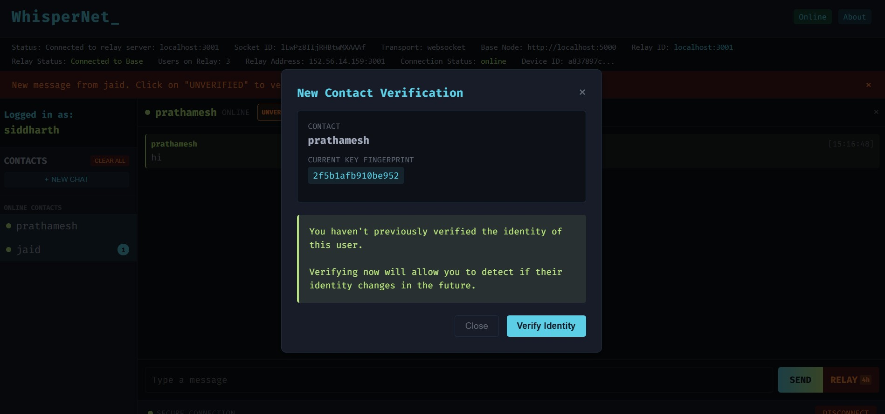
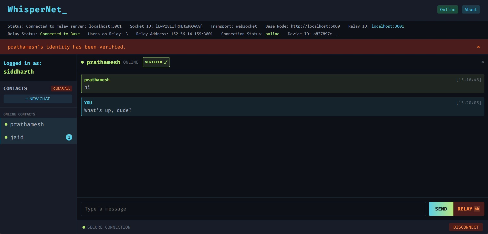

# WhisperNet

<div align="center">
  
  <h3>Secure, Decentralized Messaging Platform</h3>
  <p>End-to-end encrypted communication with distributed relay network</p>
  
  <p>
    
    
    
    
    
  </p>
</div>

## Table of Contents

- [Overview](#overview)
  - [Privacy Advantages](#privacy-advantages)
- [Features](#features)
- [Screenshots](#screenshots)
- [Architecture](#architecture)
  - [Components](#components)
  - [Security Model](#security-model)
- [Installation and Setup](#installation-and-setup)
  - [Quick Start](#quick-start)
  - [Prerequisites](#prerequisites)
  - [Backend Setup](#backend-setup)
  - [Frontend Setup](#frontend-setup)
- [Usage Guide](#usage-guide)
  - [Getting Started](#getting-started)
  - [Security Best Practices](#security-best-practices)
  - [Key Verification](#key-verification)
- [Technical Details](#technical-details)
  - [Encryption](#encryption)
  - [Network Architecture](#network-architecture)
  - [Data Storage](#data-storage)
  - [Privacy and Security Considerations](#privacy-and-security-considerations)
- [Development](#development)
  - [Project Structure](#project-structure)
  - [Building for Production](#building-for-production)
  - [Deployment](#deployment)
- [Contributing](#contributing)
- [Future Development](#future-development)
- [License](#license)
- [Collaborators](#collaborators)

## Overview

WhisperNet is a secure, decentralized messaging platform designed for private communications. It uses end-to-end encryption and a distributed relay network to ensure your messages remain private and secure.

The application provides a modern, intuitive interface for secure messaging while maintaining robust privacy and security features under the hood.

### Privacy Advantages

WhisperNet offers several privacy advantages over traditional messaging platforms:

- **No Central Storage**: Messages are not stored on central servers
- **No Account Requirements**: No phone number, email, or personal information required
- **No Metadata Collection**: Minimal metadata is generated or stored
- **Distributed Architecture**: No single point of failure or surveillance
- **Client-Side Encryption**: Messages are encrypted before leaving your device
- **Open Source**: Transparent code that can be audited for security

## Features

- **End-to-End Encryption**: All messages are encrypted on your device before being sent. Only the intended recipient can decrypt and read them.
- **Distributed Relay Network**: Instead of storing messages on a central server, WhisperNet uses a network of relay nodes to pass messages between users.
- **Message Bouncing**: When a recipient is offline, messages "bounce" through the relay network until delivery. Messages are never stored permanently on any server.
- **Direct Messaging**: Send encrypted messages directly when both users are online.
- **Relay Messaging**: Send messages that will be delivered when the recipient comes online.
- **Identity Verification**: Verify the identity of your contacts to prevent man-in-the-middle attacks.
- **Offline Message Delivery**: Messages sent while you're offline will be delivered when you reconnect.

## Screenshots

<div align="center">
  <div style="display: flex; flex-wrap: wrap; justify-content: center; gap: 10px;">
    
    
  </div>
  <div style="display: flex; flex-wrap: wrap; justify-content: center; gap: 10px; margin-top: 10px;">
    
    
  </div>
</div>

## Architecture

WhisperNet consists of several key components that work together to provide secure, decentralized messaging:

```
┌─────────────────┐     ┌─────────────────┐     ┌─────────────────┐
│                 │     │                 │     │                 │
│  User Interface │     │  Relay Network  │     │  Encryption     │
│                 │     │                 │     │  System         │
└────────┬────────┘     └────────┬────────┘     └────────┬────────┘
         │                       │                       │
         │                       │                       │
         ▼                       ▼                       ▼
┌─────────────────┐     ┌─────────────────┐     ┌─────────────────┐
│ - Login         │     │ - Message       │     │ - Key           │
│ - Chat UI       │     │   Routing       │     │   Generation    │
│ - User List     │     │ - Relay         │     │ - Encryption    │
│ - Message Input │     │   Bouncing      │     │ - Decryption    │
│ - Verification  │     │ - User Status   │     │ - Verification  │
└────────┬────────┘     └────────┬────────┘     └────────┬────────┘
         │                       │                       │
         │                       │                       │
         ▼                       ▼                       ▼
┌───────────────────────────────────────────────────────────────┐
│                                                               │
│                    Secure Communication                       │
│                                                               │
└───────────────────────────────────────────────────────────────┘
```

### Components

1. **Frontend**: React-based user interface with real-time updates
2. **Backend**: Node.js server with Socket.IO for real-time communication
3. **Relay Network**: Distributed system of relay nodes for message routing
4. **Encryption System**: Client-side encryption using Web Crypto API

### Security Model

WhisperNet uses asymmetric cryptography (public/private key pairs) to secure communications:

- Each user generates a unique cryptographic identity
- Messages are encrypted with the recipient's public key
- Only the recipient's private key can decrypt the messages
- Key verification ensures you're talking to the right person

## Installation and Setup

### Quick Start

```bash
# Clone the repository
git clone https://github.com/yourusername/WhisperNet.git
cd WhisperNet

# Start the backend server
cd backend
npm install
npm start

# In a new terminal, start the frontend
cd ../frontend
npm install
npm start
```

Visit `http://localhost:3000` in your browser to use WhisperNet.

### Prerequisites

- Node.js (v14 or higher)
- npm or yarn

### Backend Setup

1. Clone the repository:
   ```bash
   git clone https://github.com/sidinsearch/WhisperNet.git
   cd WhisperNet
   ```

2. Install dependencies:
   ```bash
   cd backend
   npm install
   ```

3. Start the server:
   ```bash
   npm start
   ```
   The server will run on port 5000 by default.

### Frontend Setup

1. Install dependencies:
   ```bash
   cd frontend
   npm install
   ```

2. Create a `.env` file in the frontend directory with:
   ```
   REACT_APP_BASE_NODE_URL=http://localhost:5000
   ```

3. Start the development server:
   ```bash
   npm start
   ```
   The application will be available at http://localhost:3000

## Usage Guide

### Getting Started

1. **Register**: Enter a username to register with the network
2. **Add Contacts**: Start a conversation by entering a username
3. **Verify Contacts**: Verify the identity of your contacts for enhanced security
4. **Send Messages**: Exchange encrypted messages with your contacts
5. **Relay Messages**: Send messages to offline contacts that will be delivered when they come online

### Security Best Practices

- Verify the identity of your contacts before sharing sensitive information
- Use unique usernames that are difficult to guess
- Keep your browser and device secure to protect your encryption keys

### Key Verification

WhisperNet provides a key verification system to ensure you're communicating with the right person:

1. When you first chat with someone, you'll see a "Not Verified" indicator
2. Click on the verification button to see their key fingerprint
3. Compare this fingerprint with your contact through a separate secure channel (in person, phone call, etc.)
4. If the fingerprints match, mark the contact as verified
5. Once verified, you'll be alerted if their key ever changes, protecting against man-in-the-middle attacks

## Technical Details

### Encryption

WhisperNet uses the Web Crypto API to implement RSA-OAEP encryption with 2048-bit keys. All encryption and decryption happens client-side, ensuring that private keys never leave the user's device.

### Network Architecture

#### Relay Network Overview

The WhisperNet relay network consists of:

1. **Base Node**: The central coordination point that handles user registration and relay assignment
2. **Relay Nodes**: Distributed servers that handle message routing between users
3. **Client Applications**: The user-facing applications that connect to the relay network

```
┌─────────────────────────────────────────────────────────────────┐
│                                                                 │
│                         Base Node                               │
│                                                                 │
└───────────┬─────────────────────┬─────────────────────┬─────────┘
            │                     │                     │
            ▼                     ▼                     ▼
┌───────────────────┐  ┌───────────────────┐  ┌───────────────────┐
│                   │  │                   │  │                   │
│    Relay Node 1   │  │    Relay Node 2   │  │    Relay Node 3   │
│                   │  │                   │  │                   │
└─┬─────────────────┘  └───────────────┬───┘  └─────────────────┬─┘
  │                                    │                        │
  │                                    │                        │
  ▼                                    ▼                        ▼
┌─────┐  ┌─────┐  ┌─────┐    ┌─────┐  ┌─────┐       ┌─────┐  ┌─────┐
│User1│  │User2│  │User3│    │User4│  │User5│       │User6│  │User7│
└─────┘  └─────┘  └─────┘    └─────┘  └─────┘       └─────┘  └─────┘
```

#### Connection Flow

When a user connects to WhisperNet:

1. They first connect to the Base Node for authentication
2. The Base Node assigns them to the most appropriate Relay Node
3. The user connects to their assigned Relay Node for messaging
4. If their assigned Relay Node goes offline, they automatically reconnect to the Base Node for reassignment

```
┌─────┐          ┌───────────┐          ┌───────────┐
│     │  1. Auth │           │ 2. Assign│           │
│User │─────────►│ Base Node │─────────►│ Relay Node│
│     │◄─────────│           │◄─────────│           │
└─────┘  4. Info └───────────┘  3. Info └───────────┘
    ▲                                        │
    │                                        │
    └────────────────────────────────────────┘
              5. Direct Connection
```

#### Message Routing

Messages are routed through the relay network using the following process:

```
┌─────────┐                                      ┌─────────┐
│         │  1. Encrypt with recipient's key     │         │
│ Sender  │─────────────────────────────────────►│Recipient│
│         │                                      │         │
└────┬────┘                                      └────┬────┘
     │                                                │
     │ 2. Send to relay                               │ 5. Decrypt
     ▼                                                ▼
┌────────────────────────────────────────────────────────────┐
│                                                            │
│                      Relay Network                         │
│                                                            │
│  ┌─────────────┐    ┌─────────────┐    ┌─────────────┐     │
│  │             │    │             │    │             │     │
│  │ Relay Node 1│───►│ Relay Node 2│───►│ Relay Node 3│     │
│  │             │    │             │    │             │     │
│  └─────────────┘    └─────────────┘    └─────────────┘     │
│         │                 ▲                  │             │
│         │                 │                  │             │
│         └─────────────────┘                  │             │
│         3. Bounce if recipient offline       │            │
│                                              │             │
└──────────────────────────┬─────────────────────────────────┘
                           │
                           │ 4. Deliver when online
                           ▼
                      ┌─────────┐
                      │         │
                      │Recipient│
                      │         │
                      └─────────┘
```

1. Sender encrypts the message with the recipient's public key
2. Message is sent to the relay network
3. If the recipient is online, the message is delivered immediately
4. If the recipient is offline, the message bounces through the relay network until the recipient comes online
5. Recipient decrypts the message with their private key

This architecture provides:
- Scalability through distributed message handling
- Resilience through automatic failover
- Privacy through decentralized message routing


### Data Storage

- Encryption keys are stored in the browser's localStorage
- Chat history is stored locally and encrypted
- No messages are stored permanently on any server

### Privacy and Security Considerations

WhisperNet is designed with privacy and security as core principles:

#### Privacy Features

- **No Central Database**: Unlike traditional messaging apps, WhisperNet doesn't store your messages, contacts, or metadata in a central database.
- **Minimal Metadata**: The system is designed to generate and store as little metadata as possible.
- **No Personal Information**: You don't need to provide a phone number, email address, or any personal information to use WhisperNet.
- **IP Protection**: Your IP address is hidden from message recipients through the relay network.
- **Local Storage**: All user data is stored locally on your device, not on remote servers.

#### Security Measures

- **End-to-End Encryption**: All messages are encrypted on the sender's device and can only be decrypted by the intended recipient.
- **Forward Secrecy**: The system is designed to protect past communications even if keys are compromised in the future.
- **Key Verification**: Users can verify each other's encryption keys to prevent man-in-the-middle attacks.
- **Open Source**: The code is open source, allowing for security audits and transparency.
- **No Backdoors**: The system is designed without backdoors or key escrow mechanisms.

#### Threat Model

WhisperNet is designed to protect against:

- **Server Compromise**: Even if relay servers are compromised, the attacker cannot read message contents.
- **Network Surveillance**: Messages are encrypted and routed through multiple relays, making traffic analysis difficult.
- **Man-in-the-Middle Attacks**: Key verification prevents impersonation attacks.
- **Metadata Analysis**: Minimal metadata is generated or stored, limiting what can be learned from traffic patterns.

However, WhisperNet cannot protect against:

- **Device Compromise**: If your device is compromised, the attacker can access your keys and messages.
- **Social Engineering**: Users must verify keys through secure channels to prevent impersonation.
- **Quantum Computing**: Current encryption methods may be vulnerable to future quantum computers.

## Development

### Project Structure

```
WhisperNet/
├── backend/           # Node.js server
│   ├── server.js      # Main server file
│   └── ...
├── frontend/          # React application
│   ├── public/        # Static files
│   ├── src/           # Source code
│   │   ├── components/# React components
│   │   ├── utils/     # Utility functions
│   │   └── App.js     # Main application component
│   └── ...
└── icon/              # Application icons
```

### Building for Production

1. Build the frontend:
   ```bash
   cd frontend
   npm run build
   ```

2. Serve the built files:
   ```bash
   cd backend
   npm start
   ```

### Deployment

#### Server Deployment

You can deploy WhisperNet on your own server using the following steps:

1. **Prerequisites**:
   - A server with Node.js installed (v14 or higher)
   - Nginx or Apache for reverse proxy (recommended)
   - Domain name (optional but recommended)
   - SSL certificate (recommended for security)

2. **Clone and Build**:
   ```bash
   # Clone the repository
   git clone https://github.com/yourusername/WhisperNet.git
   cd WhisperNet
   
   # Build the frontend
   cd frontend
   npm install
   npm run build
   
   # Setup the backend
   cd ../backend
   npm install
   ```

3. **Setup Process Manager (PM2)**:
   ```bash
   # Install PM2 globally
   npm install -g pm2
   
   # Start the backend server with PM2
   pm2 start server.js --name whisper-backend
   
   # Start the relay server with PM2
   cd ../relay-server
   pm2 start server.js --name whisper-relay
   
   # Save the PM2 configuration
   pm2 save
   
   # Setup PM2 to start on system boot
   pm2 startup
   ```

4. **Nginx Configuration** (example):
   ```nginx
   server {
       listen 80;
       server_name yourdomain.com;
       
       # Redirect HTTP to HTTPS
       return 301 https://$host$request_uri;
   }
   
   server {
       listen 443 ssl;
       server_name yourdomain.com;
       
       ssl_certificate /path/to/cert.pem;
       ssl_certificate_key /path/to/key.pem;
       
       # Frontend static files
       location / {
           root /path/to/WhisperNet/frontend/build;
           index index.html;
           try_files $uri $uri/ /index.html;
       }
       
       # Backend API
       location /api {
           proxy_pass http://localhost:5000;
           proxy_http_version 1.1;
           proxy_set_header Upgrade $http_upgrade;
           proxy_set_header Connection 'upgrade';
           proxy_set_header Host $host;
           proxy_cache_bypass $http_upgrade;
       }
       
       # Socket.IO for backend
       location /socket.io {
           proxy_pass http://localhost:5000;
           proxy_http_version 1.1;
           proxy_set_header Upgrade $http_upgrade;
           proxy_set_header Connection 'upgrade';
           proxy_set_header Host $host;
           proxy_cache_bypass $http_upgrade;
       }
   }
   ```

5. **Firewall Configuration**:
   ```bash
   # Allow HTTP, HTTPS, and WebSocket traffic
   sudo ufw allow 80/tcp
   sudo ufw allow 443/tcp
   sudo ufw allow 5000/tcp  # Backend server port
   sudo ufw allow 5001/tcp  # Relay server port
   ```

#### Cloud Deployment

WhisperNet can be deployed on various cloud platforms:

##### AWS Deployment

1. **EC2 Instance**:
   - Launch an EC2 instance with Ubuntu Server
   - Follow the server deployment steps above
   - Configure Security Groups to allow necessary ports

2. **Using Elastic Beanstalk**:
   - Create a new Elastic Beanstalk application
   - Choose Node.js as the platform
   - Upload a zip file containing your application
   - Configure environment variables in the Elastic Beanstalk console

##### Heroku Deployment

1. **Backend Deployment**:
   ```bash
   cd backend
   heroku create whisper-backend
   git init
   heroku git:remote -a whisper-backend
   git add .
   git commit -m "Initial backend deployment"
   git push heroku master
   ```

2. **Frontend Deployment**:
   ```bash
   cd frontend
   heroku create whisper-frontend
   # Add buildpack for create-react-app
   heroku buildpacks:set mars/create-react-app
   git init
   heroku git:remote -a whisper-frontend
   git add .
   git commit -m "Initial frontend deployment"
   git push heroku master
   ```

3. **Environment Variables**:
   - Set the backend URL in the frontend:
     ```bash
     heroku config:set REACT_APP_BASE_NODE_URL=https://whisper-backend.herokuapp.com -a whisper-frontend
     ```

##### Docker Deployment

1. **Create a Dockerfile for the backend**:
   ```dockerfile
   FROM node:14
   WORKDIR /app
   COPY package*.json ./
   RUN npm install
   COPY . .
   EXPOSE 5000
   CMD ["node", "server.js"]
   ```

2. **Create a Dockerfile for the frontend**:
   ```dockerfile
   FROM node:14 as build
   WORKDIR /app
   COPY package*.json ./
   RUN npm install
   COPY . .
   RUN npm run build
   
   FROM nginx:alpine
   COPY --from=build /app/build /usr/share/nginx/html
   COPY nginx.conf /etc/nginx/conf.d/default.conf
   EXPOSE 80
   CMD ["nginx", "-g", "daemon off;"]
   ```

3. **Create a docker-compose.yml file**:
   ```yaml
   version: '3'
   services:
     backend:
       build: ./backend
       ports:
         - "5000:5000"
       environment:
         - NODE_ENV=production
     
     relay:
       build: ./relay-server
       ports:
         - "5001:5001"
       environment:
         - NODE_ENV=production
         - BASE_NODE_URL=http://backend:5000
     
     frontend:
       build: ./frontend
       ports:
         - "80:80"
       depends_on:
         - backend
         - relay
   ```

4. **Build and run with Docker Compose**:
   ```bash
   docker-compose up -d
   ```

## Contributing

Contributions are welcome! Please feel free to submit a Pull Request.

## Future Development

We have several exciting features planned for future releases:

- **Mobile Applications**: Native mobile apps for iOS and Android
- **Group Messaging**: Secure group conversations with end-to-end encryption
- **File Sharing**: Encrypted file transfer capabilities
- **Self-Hosted Relays**: Allow users to run their own relay nodes
- **Offline Mode**: Enhanced offline capabilities with local-first architecture
- **Voice and Video Calls**: Encrypted real-time communication

## License

This project is licensed under the MIT License - see the LICENSE file for details.

## Collaborators

<div align="center">
  <table>
    <tr>
      <td align="center">
        <a href="https://github.com/Prathamesh0901">
          
          <br />
          <sub><b>Prathmesh Mane</b></sub>
        </a>
        <br />
        <a href="https://github.com/Prathamesh0901">github.com/Prathamesh0901</a>
      </td>
      <td align="center">
        <a href="https://github.com/JaidTamboli">
          
          <br />
          <sub><b>Jaid Tamboli</b></sub>
        </a>
        <br />
        <a href="https://github.com/JaidTamboli">github.com/JaidTamboli</a>
      </td>
      <td align="center">
        <a href="https://github.com/sidinsearch">
          
          <br />
          <sub><b>Siddharth Shinde</b></sub>
        </a>
        <br />
        <a href="https://github.com/sidinsearch">github.com/sidinsearch</a>
      </td>
    </tr>
  </table>
</div>